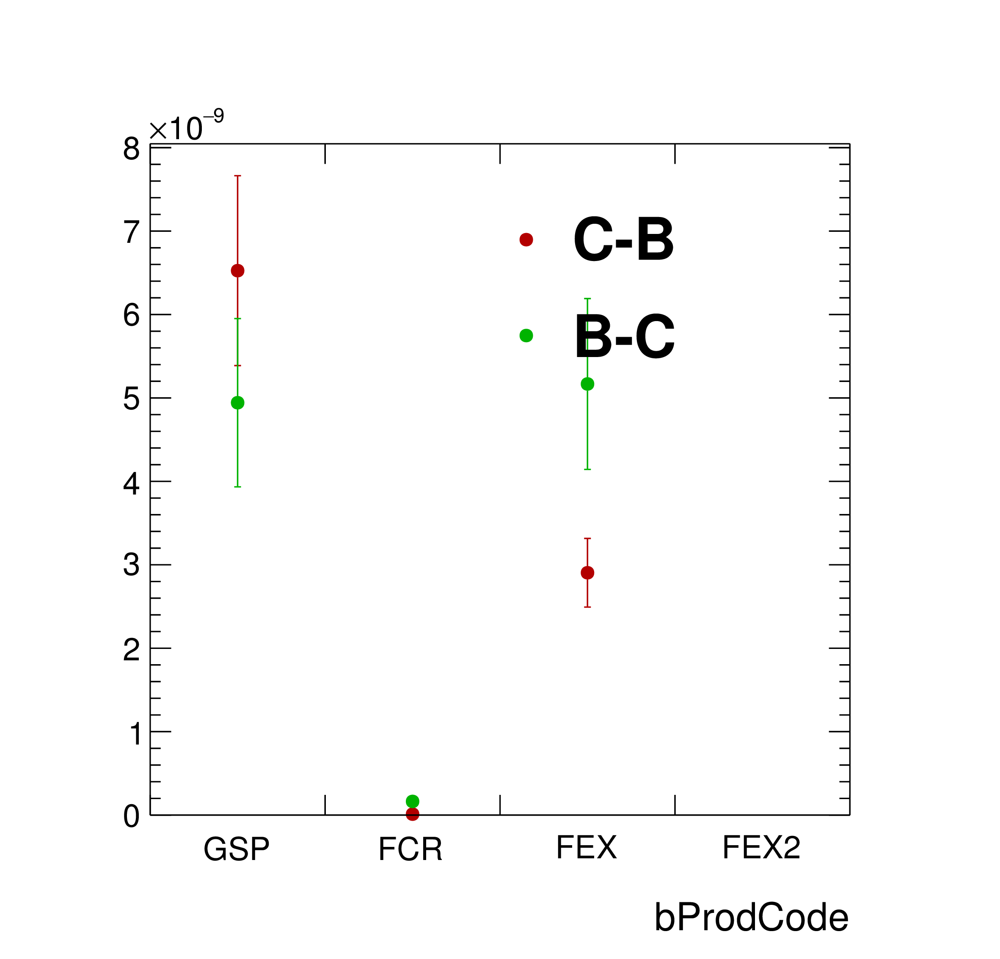
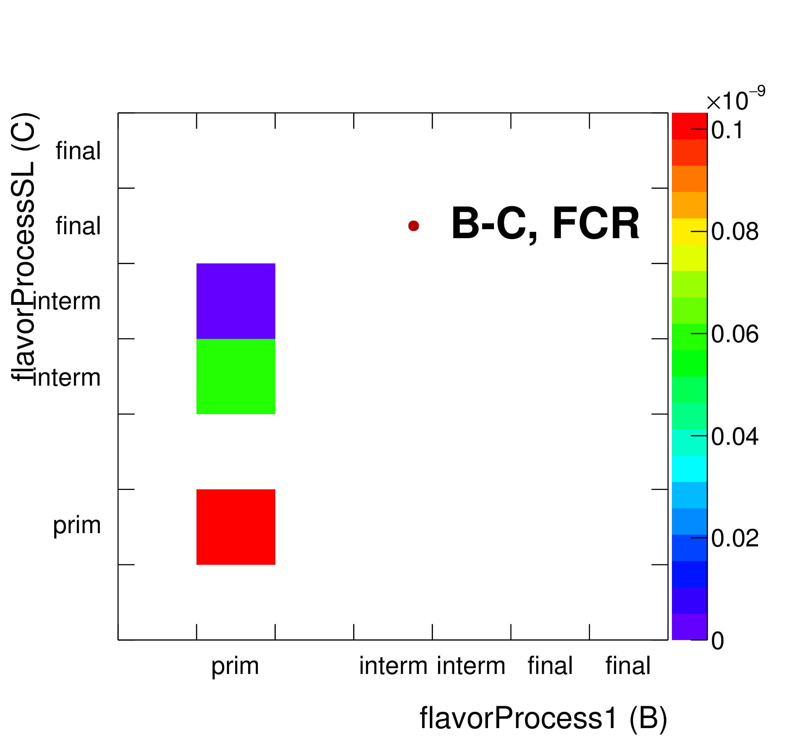
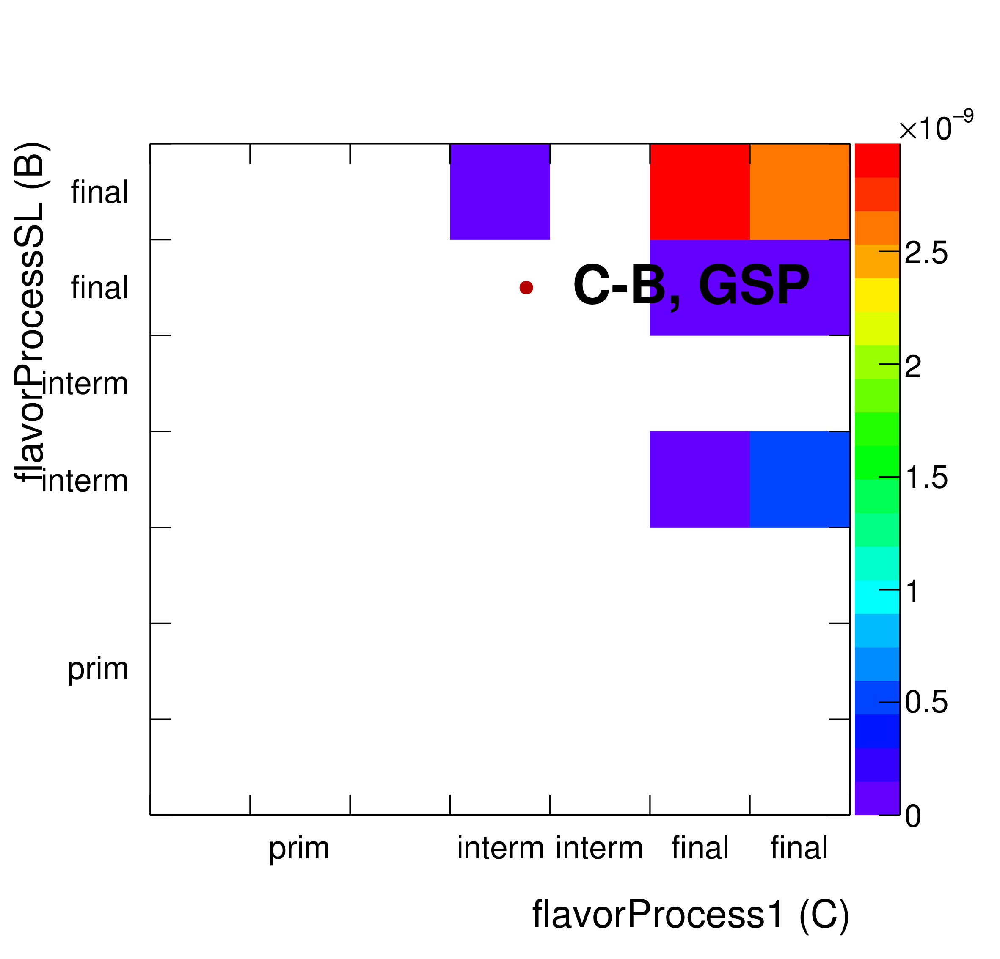
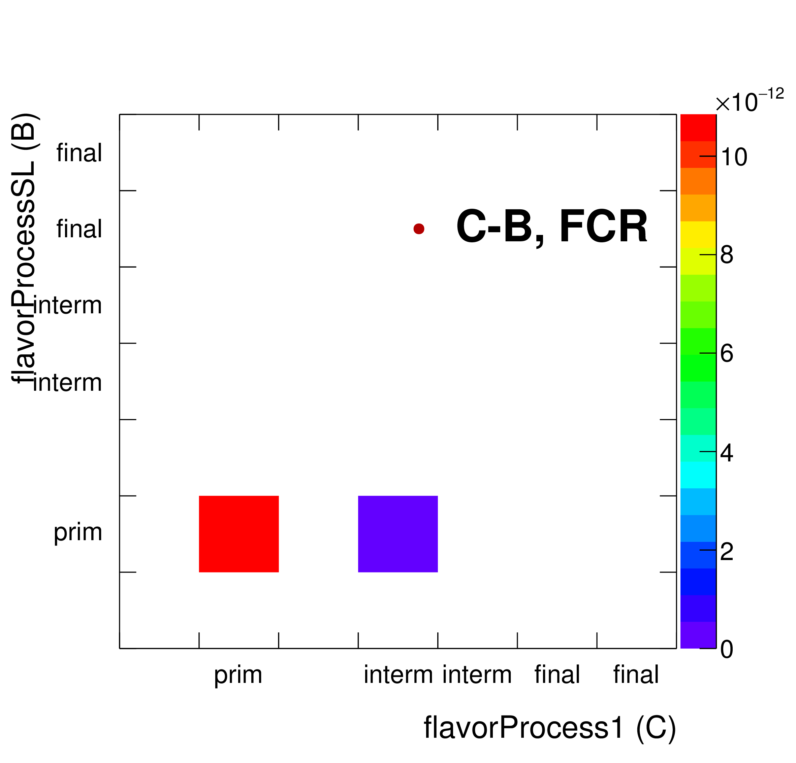
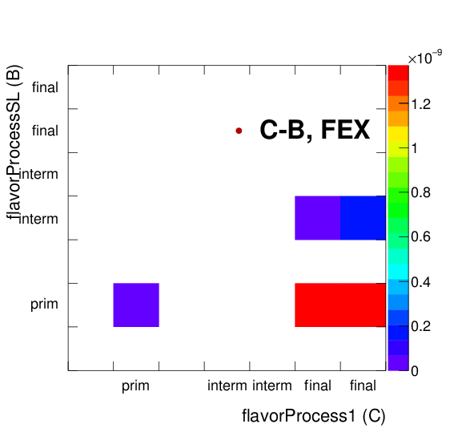
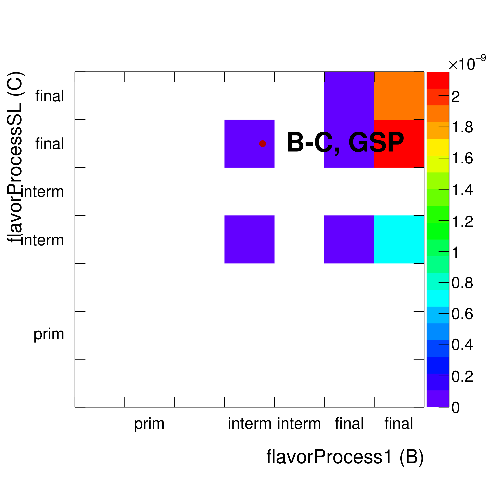
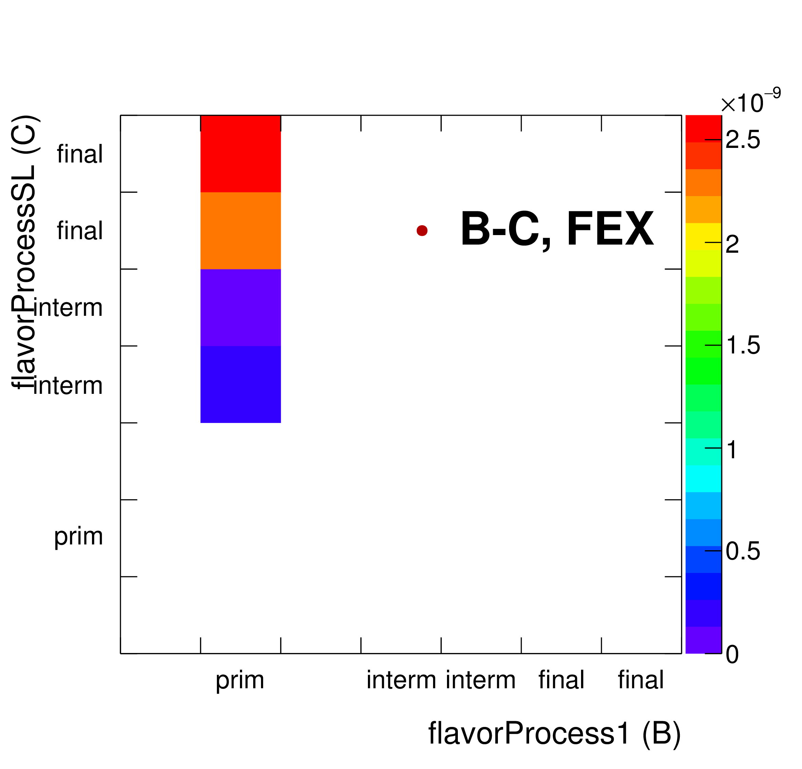

#What is b-c?

##Production codes
Both B-C and C-B come from GSP and FEX mostly

Summary of plots below:

 * Gluon splitting happens on the later stages.
 * Flavor Excitation: B is primary, C is final

##C-B

<!---->

## B-C

